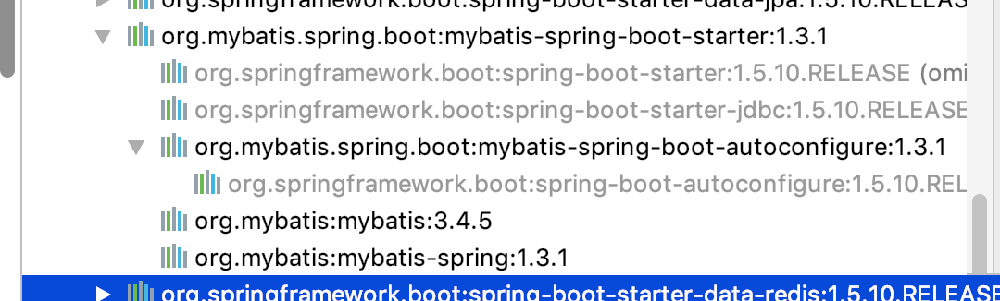
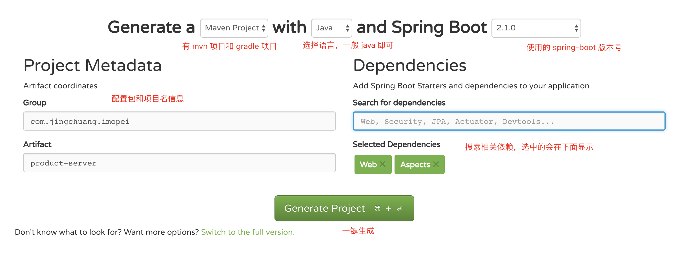
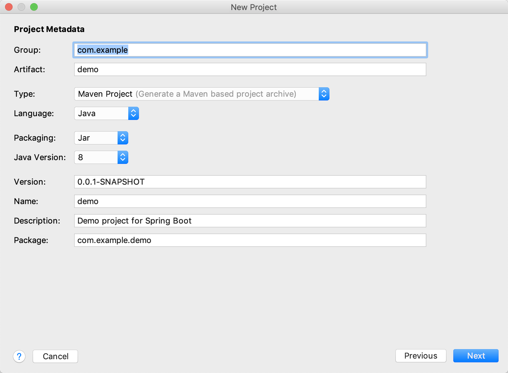

# Table of Contents

* [什么是 `spring-boot`](#什么是-`spring-boot`)
  * [一. 简述](#一-简述)
  * [二. spring-boot 介绍](#二-spring-boot-介绍)
  * [三. `spring-boot` 是否真的轻量级？](#三-`spring-boot`-是否真的轻量级？)
  * [四. 什么是 `starter`](#四-什么是-`starter`)
  * [五. 构建](#五-构建)
  * [六. 参考资料](#六-参考资料)


# 什么是 `spring-boot`

## 一. 简述

用了一年多的 `spring-boot` 进行项目开发了，我想我有必要把平时开发遇到的，我自己个人在项目中要求 `spring-boot` 做到的整理成一份主题博客。一来整理一下用了 `spring-boot` 这么久以来的收获，二来也好给自己有个知识的重新整理和归纳。

## 二. spring-boot 介绍

讲真，项目还在用 `spring` 的时候，听说别人在用 `spring-boot` 感觉，哇塞，好高大上的样子。于是乎我就去百度了解一圈，查了一下相关资料，按照我印象中来说：`spring-boot` 就是官方为了解决经常在项目中整合第三方中间件的时候，需要配置一堆 `xml` 的麻烦，开发出来的，通过非常简单的依赖和配置，从而完成与第三方中间件的整合，也可以解决常常因为版本的不兼容导致项目的出错，也可以减轻项目开发中对 `spring` 的重量级配置（这句话我下面会反驳）。

## 三. `spring-boot` 是否真的轻量级？

答案：**否**（对上一节中最后一句话的回答）

通过使用我发现几点：

1. 需要依赖第三方的时候，常常是官方会提供一个 `starter` 相关的整合包，放于 `mvn` 中。打开 `mvn` 的依赖其实可以发现，其实就是通过 `mvn` 的级联依赖的特性，以前该依赖进来的，还是会依赖进来；

2. 配置是 `yml` 文件，通过定义一些前缀，然后到里面的属性，只需要短短几行代码就可以启动运行了，因为大部分配置，都有**默认**的配置


而做这几件事情的，就是依赖的对应的第三方插件提供的 `starter`

## 四. 什么是 `starter`

概括一下：`starter` 就是中间件官方根据 `spring-boot` 提供的一系列接口，让中间件官方可以在这个 `starter` 里面去定义初始化的流程，包括读取的配置以及依赖的第三方 `jar` 包，以便让使用者可以通过简单的配置，就可以整合第三方中间件。

`mvn`  的 `starter` 依赖示例：

```yaml

<dependency>
    <groupId>org.springframework.boot</groupId>
    <artifactId>spring-boot-starter-web</artifactId>
</dependency>
<dependency>
    <groupId>org.springframework.boot</groupId>
    <artifactId>spring-boot-starter-aop</artifactId>
</dependency>

<dependency>
    <groupId>org.mybatis.spring.boot</groupId>
    <artifactId>mybatis-spring-boot-starter</artifactId>
   <!-- <version>1.1.1</version>-->
</dependency>
<dependency>
    <groupId>org.springframework.boot</groupId>
    <artifactId>spring-boot-starter-data-redis</artifactId>
</dependency>

```


从下图可以看到，`mybatis` 官方提供的 `starter` 里面的东西其实看起来都是那么熟悉。




## 五. 构建

`spring` 官方提供了几个构建方式：

- 可以直接从官网定制下载已经构建好的包 [spring 脚手架](http://start.spring.io/)



- `idea` 提供的构建方式（数据是从上面接口读取的，所以属性什么的基本一样）



- `eclipse` 搭载 `spring` 提供的 `spring tool suite`
- 手写 `mvn` 的 `pom` 搭建（推荐）

```xml
<?xml version="1.0" encoding="UTF-8"?>
<project xmlns="http://maven.apache.org/POM/4.0.0"
         xmlns:xsi="http://www.w3.org/2001/XMLSchema-instance"
         xsi:schemaLocation="http://maven.apache.org/POM/4.0.0 http://maven.apache.org/xsd/maven-4.0.0.xsd">
    <modelVersion>4.0.0</modelVersion>

    <groupId>cn.liweidan.springboot</groupId>
    <artifactId>spring-boot-tutorial</artifactId>
    <version>1.0.0-SNAPSHOT</version>

    <dependencyManagement>
        <dependencies>

            <!-- 导入官方的 spring-boot 父类作为依赖 -->
            <dependency>
                <groupId>org.springframework.boot</groupId>
                <artifactId>spring-boot-dependencies</artifactId>
                <version>2.1.0.RELEASE</version>
                <type>pom</type>
                <scope>import</scope>
            </dependency>

        </dependencies>
    </dependencyManagement>

</project>
```

一般来说，我们项目都需要有自己的父类，这时候又要使用 `spring-boot` 官方的父类，只需要把他的导进来即可，这样子项目就都可以使用 `spring-boot` 的相关组件了。

> 接下来的所有项目我将在这个父级下进行构建

## 六. 参考资料

感谢各位大佬的付出

[纯洁的微笑 -- springboot](http://www.ityouknow.com/spring-boot.html)

[唐亚峰 -- spring-boot](https://blog.battcn.com/categories/SpringBoot/)


