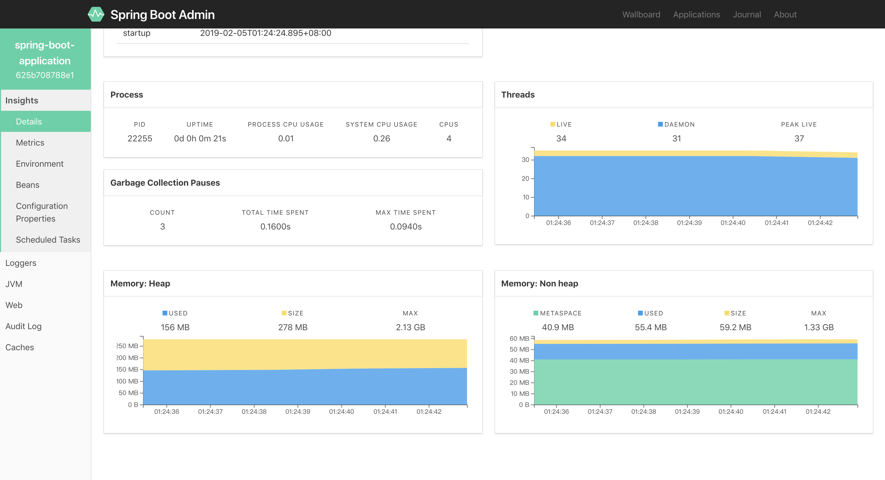

# springboot 监控 结合 spring-boot-admin 实现项目监控


* [springboot 监控 结合 spring-boot-admin 实现项目监控](#springboot-监控-结合-spring-boot-admin-实现项目监控)
  * [一. 简述](#一-简述)
  * [二. 开发](#二-开发)
    * [（一） spring-boot-admin 服务端的搭建](#（一）-spring-boot-admin-服务端的搭建)
      * [1.mvn依赖：](#1mvn依赖：)
      * [2.启动器编写](#2启动器编写)
      * [3.配置文件 application.yml](#3配置文件-applicationyml)
  * [（二）spring-boot-admin 客户端集成到 springboot 项目](#（二）spring-boot-admin-客户端集成到-springboot-项目)
      * [1.mvn依赖](#1mvn依赖)
      * [2.启动器编写](#2启动器编写-1)
      * [3.配置文件application.yml](#3配置文件applicationyml)
  * [三. 测试](#三-测试)

## 一. 简述

针对基于 `SpringBoot` 构建的微服务项目（当然也可以是普通项目），我们可以通过 `SpringBoot` 官方提供的 `spring-boot-starter-actuator` 套件进行监控。但是这个套件有个问题，就是只有 `HTTP` 接口可以调用，如果我们需要可视化的监控界面，则需要配置 `ELK` 或者其他的后台管理系统调用这个接口获取系统的信息。

当然，还有一种解决方案就是使用 `spring-boot-admin` 这个项目来监控我们的微服务系统，这是一个开源的项目，用起来还是蛮舒服的，所以在这里推荐大家可以用一用。

`spring-boot-admin` 有两种方式可以集成到系统中，一种是使用 `spring-cloud` 的服务发现，另外一种是直接配置监控的服务地址，这样 `admin` 服务即可接收到我们配置的系统的一些信息和快照了。

由于这里还不涉及 `spring-cloud` 所以这里先使用我们自己的服务集成 `admin-client` 的方式来集成系统监控。

## 二. 开发

### （一） spring-boot-admin 服务端的搭建

#### 1.mvn依赖：

```xml
<dependencies>
    <!-- 注意：admin-server的版本号要和spring-boot的版本号对应起来，不然会出现错误 -->
    <dependency>
        <groupId>de.codecentric</groupId>
        <artifactId>spring-boot-admin-starter-server</artifactId>
        <version>2.1.0</version>
    </dependency>
    <dependency>
        <groupId>org.springframework.boot</groupId>
        <artifactId>spring-boot-starter-web</artifactId>
    </dependency>
</dependencies>
```

#### 2.启动器编写

```java
@SpringBootApplication
@EnableAdminServer
public class AdminServerApplication {

    public static void main(String[] args) {
        SpringApplication.run(AdminServerApplication.class, args);
    }

}
```

#### 3.配置文件 application.yml

```yaml
server:
  port: 8081
```

只配置了 `8081` 端口启动服务端，后面客户端需要用到这个端口，才能正确收集数据。


## （二）spring-boot-admin 客户端集成到 springboot 项目

#### 1.mvn依赖

```xml
<dependencies>
    <dependency>
        <groupId>org.springframework.boot</groupId>
        <artifactId>spring-boot-starter-web</artifactId>
    </dependency>
    <dependency>
        <groupId>de.codecentric</groupId>
        <artifactId>spring-boot-admin-starter-client</artifactId>
        <version>2.1.0</version>
    </dependency>
    <dependency>
        <groupId>org.springframework.boot</groupId>
        <artifactId>spring-boot-starter-security</artifactId>
    </dependency>
</dependencies>
```

#### 2.启动器编写

因为是在起步中，所以安全措施什么的，先不设置任何东西，后面需要整合的时候才做修改。

```java
@SpringBootApplication
public class AdminClientApplication {

    @Configuration
    public static class SecurityPermitAllConfig extends WebSecurityConfigurerAdapter {
        @Override
        protected void configure(HttpSecurity http) throws Exception {
            http.authorizeRequests().anyRequest().permitAll()
                    .and().csrf().disable();
        }
    }

    public static void main(String[] args) {
        SpringApplication.run(AdminClientApplication.class, args);
    }


}
```

#### 3.配置文件application.yml

```yaml
server:
  port: 8082
spring:
  boot:
    admin:
      client:
        url: http://localhost:8081/
management:
  endpoints:
    web:
      exposure:
        include: ['*']
```

同上，配置都是最简单的配置，整合起来先。暴露了所有安全相关的端口以及配置了一个 `admin-server` 的地址，让他可以发送相关信息给服务端。

## 三. 测试

打开服务端的地址：`http://localhost:8081`



可见，`spring-boot-admin` 已经显示了我们当前启动的系统的一些信息，包括 `jvm` 的信息，以及一些日志的情况，可以动态设置我们打印日志的一些等级等等。当然后面如果使用了 `spring-cloud` 的套件集成进来会更加的容易了。
