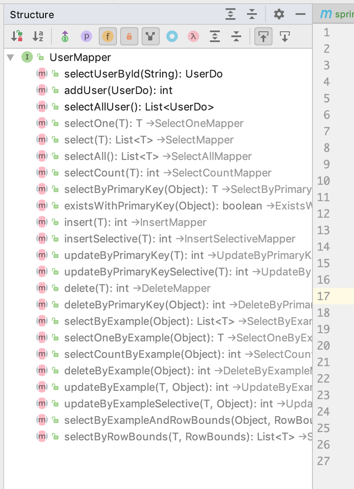

# springboot与mybatis，配合 tkmybatis/PageHelper 数据读取

## 一. 简述

`MyBatis` 是一个简单粗暴的 `orm` 框架，与 `hibernate` 相比起来，速度要快一点，封装也要少一点。如果要说封装程度的话，那就是对查询、返回结果的过程进行封装。

`SpringBoot` 只要简单的使用 `MyBatis` 官方提供的 `starter` ，稍微配置下就可以使用了。

## 二. 开发
### (一) 集成 MyBatis
#### 1. mvn依赖

```xml
<dependencies>
    <dependency>
        <groupId>org.springframework.boot</groupId>
        <artifactId>spring-boot-starter-web</artifactId>
    </dependency>
    <dependency>
        <groupId>mysql</groupId>
        <artifactId>mysql-connector-java</artifactId>
    </dependency>
    <dependency>
        <groupId>org.mybatis.spring.boot</groupId>
        <artifactId>mybatis-spring-boot-starter</artifactId>
        <version>1.3.2</version>
    </dependency>
</dependencies>

<build>
    <resources>
        <resource>
            <!-- 让 maven 把 mybatis 的 xml 拷贝到 classes -->
            <directory>src/main/resources</directory>
            <includes>
                <include>**.*</include>
                <include>**/**.*</include>
            </includes>
            <filtering>true</filtering>
        </resource>
    </resources>
</build>
```

#### 2. 用户类和仓库

```java
/** 用户数据库映射类 */
public class UserDo {

    private String uuid;

    private String name;

    private String id;

    private Long salary;
}

@Mapper // 使用注解让 SpringBoot 读取
public interface UserMapper {

    UserDo selectUserById(@Param("userUuid") String uuid);

    int addUser(UserDo userDo);

    List<UserDo> selectAllUser();

}
```

#### 3. SpringBoot配置

```yaml
spring:
  application:
    name: spring-boot-data-jpa
  datasource:
    username: root
    password: root
    driver-class-name: com.mysql.jdbc.Driver
    url: jdbc:mysql://localhost:3306/mybatis_data?useUnicode=true&characterEncoding=utf8&autoReconnect=true&allowMultiQueries=true
mybatis:
  mapper-locations: classpath*:/dbo-mapper/*.xml
```

连接的是本地数据库，需要创建表和库。

```sql
create table mybatis_data.user_db
(
	user_uuid varchar(36) not null,
	user_name varchar(50) not null,
	user_id varchar(50) not null,
	user_salary bigint null,
	constraint user_db_user_uuid_uindex
		unique (user_uuid)
)
;

alter table mybatis_data.user_db
	add primary key (user_uuid)
;
```

#### 3. 接口层

```java
@RestController
@RequestMapping("user")
public class UserEndpoint {

    private UserMapper userMapper;

    @Autowired
    public UserEndpoint(UserMapper userMapper) {
        this.userMapper = userMapper;
    }

    @GetMapping
    public List<UserDo> selectAll() {
        return userMapper.selectAllUser();
    }

    @PostMapping
    public void addUser(@RequestBody UserDo userDo) {
        userDo.setUuid(UUID.randomUUID().toString());
        userMapper.addUser(userDo);
    }

    @GetMapping("{uid}")
    public UserDo selectByUId(@PathVariable("uid") String uid) {
        return userMapper.selectUserById(uid);
    }

}
```

#### 4. 测试

```
POST http://127.0.0.1:8080/user
Content-Type: application/json

{
  "name": "gousheng",
  "salary": 1000,
  "id": "44672938219"
}

HTTP/1.1 200 
Content-Length: 0
Date: Thu, 27 Dec 2018 11:38:09 GMT

<Response body is empty>

Response code: 200; Time: 298ms; Content length: 0 bytes
--------------------------------------------------------
GET http://127.0.0.1:8080/user

HTTP/1.1 200 
Content-Type: application/json;charset=UTF-8
Transfer-Encoding: chunked
Date: Thu, 27 Dec 2018 11:38:42 GMT

[
  {
    "uuid": "d2ae789c-1e95-443c-9c5b-2501d983c538",
    "name": "gousheng",
    "id": "44672938219",
    "salary": 1000
  },
  {
    "uuid": "f444edfb-2b4a-4ba6-b4ea-8a221087e787",
    "name": "goudan",
    "id": "44672938219",
    "salary": 1000
  }
]

Response code: 200; Time: 29ms; Content length: 197 bytes
--------------------------------------------------------
GET http://127.0.0.1:8080/user/f444edfb-2b4a-4ba6-b4ea-8a221087e787

HTTP/1.1 200 
Content-Type: application/json;charset=UTF-8
Transfer-Encoding: chunked
Date: Thu, 27 Dec 2018 11:39:01 GMT

{
  "uuid": "f444edfb-2b4a-4ba6-b4ea-8a221087e787",
  "name": "goudan",
  "id": "44672938219",
  "salary": 1000
}

Response code: 200; Time: 67ms; Content length: 96 bytes
```

OK，测试通过了，如果只要单纯使用 `MyBatis` 的话，那就不需要下面的步骤了。

### (二) 集成 TkMybatis 和 PageHelper

#### 1. 加入 mvn 依赖

```xml
<dependency>
    <groupId>tk.mybatis</groupId>
    <artifactId>mapper-spring-boot-starter</artifactId>
    <version>2.1.2</version>
</dependency>

<dependency>
    <groupId>com.github.pagehelper</groupId>
    <artifactId>pagehelper-spring-boot-starter</artifactId>
    <version>1.2.10</version>
</dependency>
```

#### 2. 启动类或配置类加上 MapperScan 注解

启动类上要加入 `tkmybatis` 的 `MapperScan` 注解，需要指定扫描的 `Mapper` 接口的包位置

```java
@SpringBootApplication
@MapperScan(basePackages = "cn.liweidan.springboot.mybatis.mapper")
public class MyBatisApplication {

    public static void main(String[] args) {
        SpringApplication.run(MyBatisApplication.class, args);
    }

}
```

#### 3. DBO 加上 jpa注解

如果 `DBO` 类（数据库映射类）和数据库的表名不一样的话，还需要使用 `jpa` 注解，在类上指定：

```java
@Table(name = "user_db")
public class UserDo {

    @Column(name = "user_uuid")
    @Id
    private String uuid;

    @Column(name = "user_name")
    private String name;

    @Column(name = "user_id")
    private String id;

    @Column(name = "user_salary")
    private Long salary;

}
```

#### 4. Mapper接口修改

`Mapper` 接口需要继承 `Mapper<dbo>` 以获取通用的查询方法：

```java
@Mapper
public interface UserMapper extends tk.mybatis.mapper.common.Mapper<UserDo> {

    UserDo selectUserById(@Param("userUuid") String uuid);

    int addUser(UserDo userDo);

    List<UserDo> selectAllUser();

}
```

可使用方法：



#### 5. 调用

尝试修改 `GetByUID` 是用 `tkmybatis` 的方法

```java
@GetMapping("{uid}")
public UserDo selectByUId(@PathVariable("uid") String uid) {
    return userMapper.selectByPrimaryKey(uid);
}
```


查看是否可以正常返回：

```
GET http://127.0.0.1:8080/user/f444edfb-2b4a-4ba6-b4ea-8a221087e787

HTTP/1.1 200 
Content-Type: application/json;charset=UTF-8
Transfer-Encoding: chunked
Date: Thu, 27 Dec 2018 12:35:12 GMT

{
  "uuid": "f444edfb-2b4a-4ba6-b4ea-8a221087e787",
  "name": "goudan",
  "id": "44672938219",
  "salary": 1000
}

Response code: 200; Time: 212ms; Content length: 96 bytes
```


#### 6. 分页助手的使用

```java
@GetMapping
public PageInfo<UserDo> selectAll() {
    // 在查询的上一步调用 startPage 注意页码是从 1 开始的，第二个参数是查询多少条记录
    PageHelper.startPage(1, 1);
    // 直接返回new一个新的pageInfo即包括分页常用所需要的信息了
    return new PageInfo<>(userMapper.selectAllUser());
}
```

```
GET http://127.0.0.1:8080/user

HTTP/1.1 200 
Content-Type: application/json;charset=UTF-8
Transfer-Encoding: chunked
Date: Thu, 27 Dec 2018 12:37:32 GMT

{
  "total": 2,
  "list": [
    {
      "uuid": "d2ae789c-1e95-443c-9c5b-2501d983c538",
      "name": "gousheng",
      "id": "44672938219",
      "salary": 1000
    }
  ],
  ...
}

Response code: 200; Time: 186ms; Content length: 379 bytes
```

可以看到总数是 2 条，现在是查询 1 条记录。至此整合完毕

## 三. 总结

本文讲述了如何简单整合 `mybatis` 以及` mybatis` 插件进行日常开发使用，建议还是要第三方插件辅助支持，不然开发效率比较慢。


