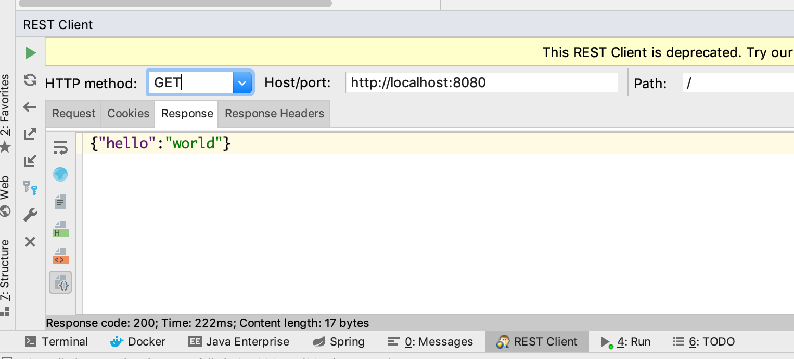
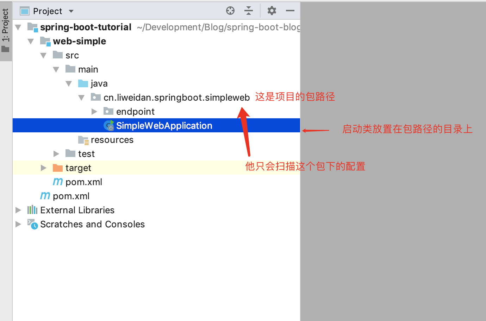

# Table of Contents

* [一个简单的入门 web 项目](#一个简单的入门-web-项目)
  * [一. 简述](#一-简述)
  * [二. 开发](#二-开发)
    * [1. `mvn` 新增 `web-starter` 的依赖](#1-`mvn`-新增-`web-starter`-的依赖)
    * [2. `controller` 编写](#2-`controller`-编写)
    * [3. 编写启动器](#3-编写启动器)
    * [4. 测试接口](#4-测试接口)
  * [三. 总结](#三-总结)


# 一个简单的入门 web 项目

## 一. 简述

其实，`spring` 在我们职业生涯中，大部分只做一件事情，那就是：`web` 项目 `bean` 的管理和整合。所以，`web` 应用是至关重要的，本文将从一个简单的 `hello world` 开始 `web` 的构建。

**示例代码：`web-simple`**

## 二. 开发

### 1. `mvn` 新增 `web-starter` 的依赖

```xml
<dependencies>
    <!-- 引入 web-starter -->
    <dependency>
        <groupId>org.springframework.boot</groupId>
        <artifactId>spring-boot-starter-web</artifactId>
    </dependency>
</dependencies>
```

### 2. `controller` 编写

```java
package cn.liweidan.springboot.simpleweb.endpoint;

import org.springframework.web.bind.annotation.GetMapping;
import org.springframework.web.bind.annotation.RestController;

import java.util.HashMap;
import java.util.Map;

/**
 * Description：HelloWorld 控制器
 * @author liweidan
 * @version 1.0
 * @date 2018/11/19 12:14 PM
 * @email toweidan@126.com
 */
@RestController // 使用 RestController，指定该控制器输出都是 json 对象
public class HelloEndpoint {

    @GetMapping // 使用 GetMapping 代替 RequestMapping、同理还有 PostMapping PutMapping DeleteMapping
    public Map<String, String> helloWorld() {
        Map<String, String> helloMap = new HashMap<>(1);
        helloMap.put("hello", "world");
        return helloMap;
    }

}

```

### 3. 编写启动器

```java
package cn.liweidan.springboot.simpleweb;

import org.springframework.boot.SpringApplication;
import org.springframework.boot.autoconfigure.SpringBootApplication;

/**
 * Description：启动器
 *
 * @author liweidan
 * @version 1.0
 * @date 2018/11/19 12:24 PM
 * @email toweidan@126.com
 */
@SpringBootApplication // 使用注解指定这是 spring-boot 项目的启动类
public class SimpleWebApplication {

    public static void main(String[] args) {
        // 固定写法，传入本类以及参数 该参数是可以在启动的时候指定覆盖配置的
        SpringApplication.run(SimpleWebApplication.class, args);
    }

}
```

到此，一个最基本的 `spring-boot` 项目就完成了

### 4. 测试接口



## 三. 总结

OK，至此一个简单的（虽然简单，但是可以在生产中使用）例子就完结了。可以对比以前，首先需要在 `web.xml` 中指定 `listener` 以及 `DispatchServlet` ，然后编写几个 `spring` 的配置文件，现在的步骤基本简单了很多。

当然在实际生产中肯定还有其他的东西需要配置，比如服务之间传递的协议、拦截器、验证器等等，我将放在后续进行编写。

这里可能会遇到一个坑：就是启动类没有在顶级的目录下导致扫描不到配置的东西，这里需要说明一下：



也就是说，比如包名 `cn.liweidan.endpoint` 他是扫描不到的，他只能扫描到 `cn.liweidan.springboot.simpleweb` 下的带有 `spring` 注解的类。

当然如果你觉得你不想这样编排，想把启动类抽出来放在一个包里面，然后又要扫描其他地方，就需要在启动类上加一个注解 `@SpringBootApplication(scanBasePackages = {"cn.liweidan.springboot"})` 传递字符串数组，即要扫描到的所有包名。如：

```java
@SpringBootApplication(scanBasePackages = {"cn.liweidan.springboot"})
public class SimpleWebApplication {
	// ...省略其他代码
}
```


