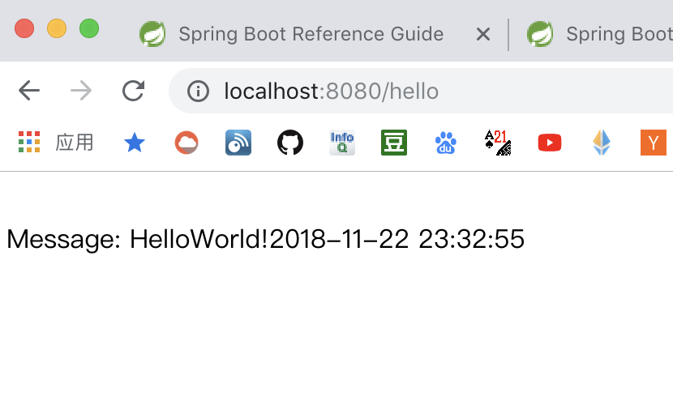
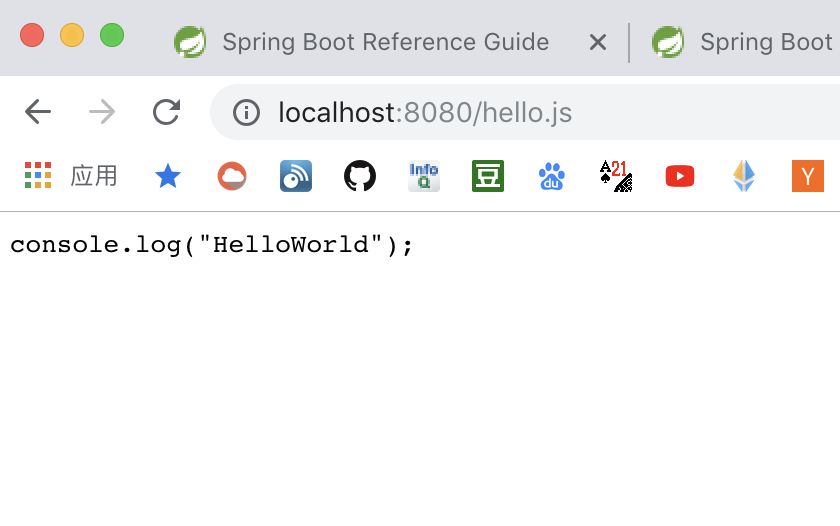

# springboot 与 freemark 模板

## 一. 简述

`Freemarker` 是一个热门的 `MVC` 模板引擎，拥有跟 `jsp` 一样的一些指令标签，广受大众的热爱。

我没真正使用过 `Freemarker` ，在即将投入使用的项目中，因为一个偶然的想法（动静分离）而彻底放弃了 `MVC` 思想，改用了前端的 `MVVM` 框架，配合 `JSON` 数据格式。

## 二. 开发

### 1. `MVN` 的依赖

```xml
<dependencies>
    <dependency>
        <groupId>org.springframework.boot</groupId>
        <artifactId>spring-boot-starter-web</artifactId>
    </dependency>
    <dependency>
        <groupId>org.springframework.boot</groupId>
        <artifactId>spring-boot-starter-freemarker</artifactId>
    </dependency>
</dependencies>
```

其实我感觉这是我写过的最简单的 `Spring-Boot` 教程了，全程不需要任何的自定义配置，只要引入依赖的包即可投入使用。

### 2. 控制器

```java
@Controller
public class HelloWorld {

    @RequestMapping("hello")
    public ModelAndView helloWorld() {
        String msg = "HelloWorld!" + new SimpleDateFormat("yyyy-MM-dd HH:mm:ss").format(new Date());
        return new ModelAndView("hello").addObject("message", msg);
    }

}
```

### 3. 编写 `ftl` 和 静态文件

需要注意两个路径，都在 `resources` 文件夹下：

1. `templates` 用于存放模板文件
2. `static` 用于存放静态资源，如：`js` `css` `html` 

`templates` 下的 `ftl` ：

```
<!DOCTYPE html>

<html lang="en">

<body>
<br>
Message: ${message}
</body>

</html>
```

`static` 下的 `js` ：

```javascript
console.log("HelloWorld")
```

### 4. 请求 `http://localhost:8080/hello` 以及 `http://localhost:8080/hello.js`





## 三. 总结

无


