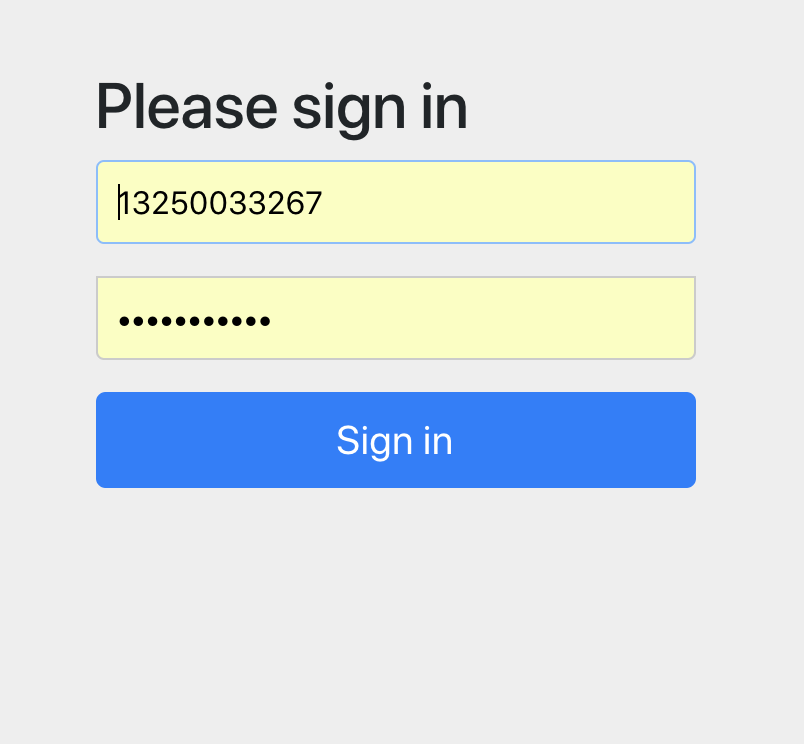

# Table of Contents

* [springboot 与 security 保护 web 安全](#springboot-与-security-保护-web-安全)
  * [一. 简述](#一-简述)
  * [二. 开发](#二-开发)
    * [1. `mvn` 依赖](#1-`mvn`-依赖)
    * [2. 定义资源](#2-定义资源)
      * [2.1 两个资源（均省略了 `getter` 和 `setter`）](#21-两个资源（均省略了-`getter`-和-`setter`）)
      * [2.2 两个资源对应的仓库](#22-两个资源对应的仓库)
      * [2.3 项目启动初始化](#23-项目启动初始化)
      * [2.4 项目配置](#24-项目配置)
    * [3. 配合 `spring-security` 开发业务层](#3-配合-`spring-security`-开发业务层)
      * [3.1 用户业务层](#31-用户业务层)
      * [3.2 资源业务层](#32-资源业务层)
      * [3.3 资源控制器](#33-资源控制器)
    * [4. 测试](#4-测试)
  * [三. 总结](#三-总结)


# springboot 与 security 保护 web 安全

## 一. 简述

做 `web` 项目，权限的事情就常常伴随着左右，比如某个用户有没有资格访问这个资源，常用的权限框架一般有 `shrio` 和 `spring-security` 。一般来说，很多公司会选择前者，因为会稍微轻量级（其实我为了写这篇文章稍微学习一下 `spring-security` 也有这种感觉，`spring` 公司把用户权限等等都已经提供了接口，不利于我们自己定制化，有好有坏吧，熟悉的话快速开发是个不错的选择）。当然现在我有种比较喜欢 `spring` 的全家桶的感觉，毕竟开发起来很面向对象。而且自家的产品，跟自己搭配起来，都会很简单的就起来了。

OK，简单的搭建没什么意义，所以这里我提前用了下 `jpa` ，简单的示例。

业务情景是这样子的：我数据库里面有一堆资源，但是有规定，不同角色只能请求不同的资源，当你的角色不匹配，请求的时候会被拒绝。用户和角色我就没分出来表了，放在同一张表，目的是快速的进行演示。

**示例代码：`web-security`**

## 二. 开发

### 1. `mvn` 依赖

```xml
<dependencies>

    <!-- web-starter -->
    <dependency>
        <groupId>org.springframework.boot</groupId>
        <artifactId>spring-boot-starter-web</artifactId>
    </dependency>

    <!-- security-starter -->
    <dependency>
        <groupId>org.springframework.boot</groupId>
        <artifactId>spring-boot-starter-security</artifactId>
    </dependency>

    <!-- jpa-starter -->
    <dependency>
        <groupId>org.springframework.boot</groupId>
        <artifactId>spring-boot-starter-data-jpa</artifactId>
    </dependency>

    <!-- mysql 依赖 -->
    <dependency>
        <groupId>mysql</groupId>
        <artifactId>mysql-connector-java</artifactId>
    </dependency>

</dependencies>
```

### 2. 定义资源

OK，因为需要类似于实战的东西，在资源定义这里我使用了 `Spring` 的钩子 + `Spring-data-jpa` 来辅助实战。

#### 2.1 两个资源（均省略了 `getter` 和 `setter`）

```java
/** 登陆的用户 */
@Entity(name = "security_user")
public class User {

    @Id
    @GeneratedValue(strategy= GenerationType.AUTO)
    @Column(name = "user_id")
    private Long id;

    @Column(name = "user_name", length = 13)
    private String name;

    @Column(name = "user_role", length = 20)
    private String role;

    public User() {
    }

    public User(String name, String role) {
        this.name = name;
        this.role = role;
    }
}
/** 请求的资源 */
@Entity(name = "security_resource")
public class Resource {

    @Id
    @GeneratedValue(strategy= GenerationType.AUTO)
    @Column(name = "res_id")
    private Long id;

    @Column(name = "res_role", length = 20)
    private String requireRole;

    @Column(name = "res_content")
    private String content;

    public Resource() {
    }

    public Resource(String requireRole, String content) {
        this.requireRole = requireRole;
        this.content = content;
    }
}
```

#### 2.2 两个资源对应的仓库

```java
@Repository
public interface UserRepository extends JpaRepository<User, Long> {

    User findByName(String name);

}
@Repository
public interface ResourceRepository extends JpaRepository<Resource, Long> {

    List<Resource> findByRequireRole(String requireRols);

}
```

#### 2.3 项目启动初始化

这个数据库包含三个用户以及对应角色可以访问到的一共十个资源，全部在启动的时候写入数据库。

```java
@Configuration
public class InitDbConfig {

    private UserRepository userRepository;
    private ResourceRepository resourceRepository;

    @Autowired
    public InitDbConfig(UserRepository userRepository, ResourceRepository resourceRepository) {
        this.userRepository = userRepository;
        this.resourceRepository = resourceRepository;
    }

    @PostConstruct
    public void initUser() {
        User user1 = new User("WEIDAN", "admin");
        User user2 = new User("XIAOMING", "vip");
        User user3 = new User("XIAOHONG", "customer");
        List<User> addUser = new ArrayList<>(3);
        addUser.add(user1);
        addUser.add(user2);
        addUser.add(user3);
        userRepository.saveAll(addUser);
    }

    @PostConstruct
    public void initResource() {
        Resource resource1 = new Resource("admin", UUID.randomUUID().toString());
        Resource resource2 = new Resource("admin", UUID.randomUUID().toString());
        Resource resource3 = new Resource("vip", UUID.randomUUID().toString());
        Resource resource4 = new Resource("admin", UUID.randomUUID().toString());
        Resource resource5 = new Resource("vip", UUID.randomUUID().toString());
        Resource resource6 = new Resource("admin", UUID.randomUUID().toString());
        Resource resource7 = new Resource("vip", UUID.randomUUID().toString());
        Resource resource8 = new Resource("admin", UUID.randomUUID().toString());
        Resource resource9 = new Resource("admin", UUID.randomUUID().toString());
        Resource resource10 = new Resource("customer", UUID.randomUUID().toString());
        List<Resource> resourceList = new ArrayList<>(10);
        resourceList.add(resource1);
        resourceList.add(resource2);
        resourceList.add(resource3);
        resourceList.add(resource4);
        resourceList.add(resource5);
        resourceList.add(resource6);
        resourceList.add(resource7);
        resourceList.add(resource8);
        resourceList.add(resource9);
        resourceList.add(resource10);
        resourceRepository.saveAll(resourceList);
    }

}
```

#### 2.4 项目配置

既然使用到了数据库，那么项目配置就必不可少了。

```yaml
spring:
  jpa:
    hibernate:
      ddl-auto: create-drop # 项目启动时生成，关闭时删掉
    show-sql: true
    database-platform: org.hibernate.dialect.MySQL5InnoDBDialect # 设置 innoDB 引擎
  datasource:
    url: jdbc:mysql://localhost:3306/security_db
    driver-class-name: com.mysql.jdbc.Driver
    username: root
    password: root
```

### 3. 配合 `spring-security` 开发业务层

#### 3.1 用户业务层

这个业务层不需要我们定义接口，用于实现 `Spring` 提供的 `UserDetailsService` 接口即可。当然一般来说我们的用户层业务不会只有他那么一个方法，所以如若需要还是要定义我们自己的用户业务层接口的。

`UserDetailsService` 这个类，只有一个方法 `loadUserByUsername`，我们需要实现它，读取我们数据库用户的数据然后返回 `Spring` 定义的 `UserDetails`，当然了，也可以使用我们自己的类来集成这个 `UserDetails`。我想这一步可能就是大家所说的 `spring-security` 不轻量级的地方吧。因为权限模型都定义了，我们还需要根据他的需要来将我们的数据转换到他的类去。

**在这里为了方便我把所有的用户的密码都设置成 `123` 了**

```java
package cn.liweidan.springboot.security.service;

import cn.liweidan.springboot.security.dbo.User;
import cn.liweidan.springboot.security.repository.UserRepository;
import org.springframework.beans.factory.annotation.Autowired;
import org.springframework.security.core.GrantedAuthority;
import org.springframework.security.core.authority.SimpleGrantedAuthority;
import org.springframework.security.core.userdetails.UserDetails;
import org.springframework.security.core.userdetails.UserDetailsService;
import org.springframework.security.core.userdetails.UsernameNotFoundException;
import org.springframework.security.crypto.bcrypt.BCryptPasswordEncoder;
import org.springframework.stereotype.Service;

import java.util.ArrayList;
import java.util.List;
import java.util.Objects;

/**
 * Description：
 *
 * @author liweidan
 * @version 1.0
 * @date 2018/11/29 10:20 AM
 * @email toweidan@126.com
 */
@Service
public class UserDetailServiceImpl implements UserDetailsService { // 实现 spring 提供的 UserDetailsService 类

    private UserRepository userRepository;

    /**
     * 使用一个 spring 提供的简单的密码编译器，用于密码的加密
     */
    private BCryptPasswordEncoder bCryptPasswordEncoder;

    @Autowired
    public UserDetailServiceImpl(UserRepository userRepository, BCryptPasswordEncoder bCryptPasswordEncoder) {
        this.userRepository = userRepository;
        this.bCryptPasswordEncoder = bCryptPasswordEncoder;
    }

    /**
     * 实现 loadUserByUsername
     * 这个方法会根据用户名取出相对应的用户数据，然后相当于转换成 spring 定义的用户类
     * spring 会在拦截登陆，登录验证，权限验证等使用到这个用户对象
     * @param name 用户名
     * @return spring 定义的用户类
     * @throws UsernameNotFoundException 没有找到用户异常
     */
    @Override
    public UserDetails loadUserByUsername(String name) throws UsernameNotFoundException {
        User user = userRepository.findByName(name);
        if (Objects.isNull(user)) {
            throw new UsernameNotFoundException(name + " is not found");
        }
        List<GrantedAuthority> grantedAuthorityList = new ArrayList<>();
        grantedAuthorityList.add(new SimpleGrantedAuthority(user.getRole()));

        return new org.springframework.security.core.userdetails.User(user.getName(), bCryptPasswordEncoder.encode("123"), grantedAuthorityList);
    }

}
```

#### 3.2 资源业务层

```java
@Service
public class ResourceService {

    private ResourceRepository resourceRepository;

    @Autowired
    public ResourceService(ResourceRepository resourceRepository) {
        this.resourceRepository = resourceRepository;
    }

    /**
     * 只有 vip 的角色才可以访问
     * @return 资源集合
     */
    @PreAuthorize("hasAuthority('vip')")
    public List<Resource> getVipResource() {
        return resourceRepository.findByRequireRole("vip");
    }

}
```

#### 3.3 资源控制器

```java
@RestController
@RequestMapping("resource")
public class ResourceEndpoint {

    @Autowired
    private ResourceService resourceService;

    @GetMapping("vip")
    public List<Resource> getVipResource() {
        return resourceService.getVipResource();
    }

}
```

### 4. 测试

启动项目，请求 `http://localhost:8080/resource/vip` 会发现请求被重定向到一个内置的登陆页面（可定制的）：




我使用 `WEIDAN` `123` 来登录（并不具备 vip 的角色）然后请求 vip 的资源。发现被拒绝访问了（这个页面可以通过之前所说的 `ControllerAdvise` 来定制）：

```
Whitelabel Error Page
This application has no explicit mapping for /error, so you are seeing this as a fallback.

Sat Dec 01 09:11:58 CST 2018
There was an unexpected error (type=Forbidden, status=403).
Forbidden
```


OK，接下来使用一个 `XIAOMING` `123` 来登录（具备 vip 角色），然后请求 vip 资源：

```json
[
    {
        "id": 6,
        "requireRole": "vip",
        "content": "963d08cd-4ddb-4601-865a-9d91470bad28"
    },
    {
        "id": 8,
        "requireRole": "vip",
        "content": "574353a7-5ec8-4383-b5b2-2b4435220069"
    },
    {
        "id": 10,
        "requireRole": "vip",
        "content": "d019d923-e267-4a18-a632-5cbecc04c012"
    }
]
```


## 三. 总结

`Spring-security` 提供了整套权限模型，如若真的计划使用来架构权限的话，需要了解有哪些类。`Spring` 依然提供了一些可以控制权限的注解类，这些类需要加在方法上面，初步感觉，可能有点不太灵活。在未来的微服务架构中我更希望是通过路由来控制接口的访问权限，而项目服务中开发就不再关注，降低耦合性，也能尽量防止在项目服务中开发错误的局面。


