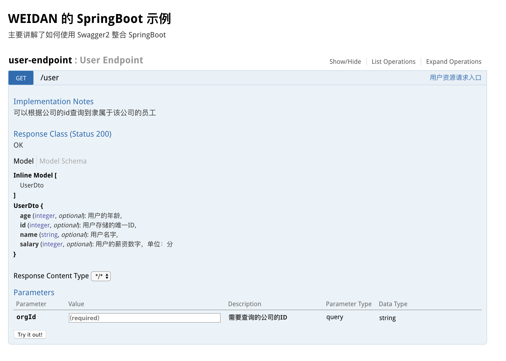

# Table of Contents

* [springboot 与接口文档系统 swagger](#springboot-与接口文档系统-swagger)
  * [一. 简述](#一-简述)
  * [二. 开发](#二-开发)
    * [1. `mvn` 引入所需要的依赖](#1-`mvn`-引入所需要的依赖)
    * [2. 编写启动器](#2-编写启动器)
    * [3. 配置一些 `swagger` 的信息](#3-配置一些-`swagger`-的信息)
    * [4. 编写控制器，并加入接口数据注解](#4-编写控制器，并加入接口数据注解)
    * [5. 编写 `UserDto` 说明](#5-编写-`userdto`-说明)
    * [6. API 文档界面](#6-api-文档界面)
  * [三. 总结](#三-总结)


# springboot 与接口文档系统 swagger

## 一. 简述

日常开发中，常常需要接口文档的交互，跟前端也好，跟 `app` 端的也好。但是如果是手动编写的文档，常常会因为各种原因（当然，懒和忘记是主要原因），会比代码滞后。这样导致的问题就比较严重了，有时候前端写完一个功能了，对接一下，哎呀，出错了。不仅增加了麻烦，还浪费了时间。

当初选择使用 `swagger` 是因为其界面还不错，清新清新的感觉。现在官网出了很多产品，但还都是需要去利用手动的去更新文档。我最喜欢的还是这种你编码一个接口顺便把文档使用注解的方式给写在了文档上面。可以有效的避免了接口更新但是忘记更新文档的尴尬。

## 二. 开发

### 1. `mvn` 引入所需要的依赖

```xml
<properties>
    <springfox-version>2.5.0</springfox-version>
    <swagger-core-version>1.5.10</swagger-core-version>
</properties>

<dependencies>

    <!-- 引入 web-starter -->
    <dependency>
        <groupId>org.springframework.boot</groupId>
        <artifactId>spring-boot-starter-web</artifactId>
    </dependency>

    <!-- 引入 swagger 相关的依赖 -->
    <dependency>
        <groupId>io.springfox</groupId>
        <artifactId>springfox-swagger2</artifactId>
        <version>${springfox-version}</version>
    </dependency>
    <dependency>
        <groupId>io.swagger</groupId>
        <artifactId>swagger-core</artifactId>
        <version>${swagger-core-version}</version>
    </dependency>
    <dependency>
        <groupId>io.springfox</groupId>
        <artifactId>springfox-swagger-ui</artifactId>
        <version>${springfox-version}</version>
    </dependency>


</dependencies>
```

### 2. 编写启动器

```java
@SpringBootApplication
@EnableSwagger2 // 启动 swagger 自动配置
public class Swagger2Application {

    public static void main(String[] args) {
        SpringApplication.run(Swagger2Application.class, args);
    }

}
```

注意需要加入 `@EnableSwagger2` 注解，`swagger` 的 `starter` 会根据所规定的流程进行初始化操作。

### 3. 配置一些 `swagger` 的信息

```java
package cn.liweidan.springboot.swagger2.config;

import com.google.common.base.Predicates;
import org.springframework.context.annotation.Bean;
import org.springframework.context.annotation.Configuration;
import springfox.documentation.builders.ApiInfoBuilder;
import springfox.documentation.builders.PathSelectors;
import springfox.documentation.service.ApiInfo;
import springfox.documentation.spi.DocumentationType;
import springfox.documentation.spring.web.plugins.Docket;

/**
 * Description：Swagger2 配置
 *
 * @author liweidan
 * @version 1.0
 * @date 2018/11/22 5:50 PM
 * @email toweidan@126.com
 */
@Configuration
public class Swagger2Config {

    @Bean
    public Docket swaggerSpringMvcPlugin() {
        return new Docket(DocumentationType.SWAGGER_2)
                .useDefaultResponseMessages(false)
                .apiInfo(apiInfo())
                .select()
                .paths(Predicates.not(PathSelectors.regex("/error.*")))
                .build();
    }

    private ApiInfo apiInfo() {
        return new ApiInfoBuilder()
                .title("WEIDAN 的 SpringBoot 示例")
                .description("主要讲解了如何使用 Swagger2 整合 SpringBoot")
                .version("2.0")
                .build();
    }

}

```

### 4. 编写控制器，并加入接口数据注解

```java
package cn.liweidan.springboot.swagger2.endpoint;

import cn.liweidan.springboot.swagger2.dbo.UserDo;
import io.swagger.annotations.ApiImplicitParam;
import io.swagger.annotations.ApiImplicitParams;
import io.swagger.annotations.ApiOperation;
import org.springframework.web.bind.annotation.GetMapping;
import org.springframework.web.bind.annotation.RequestMapping;
import org.springframework.web.bind.annotation.RequestParam;
import org.springframework.web.bind.annotation.RestController;

import java.util.*;
import java.util.stream.Collectors;

/**
 * Description：用户资源控制器
 *
 * @author liweidan
 * @version 1.0
 * @date 2018/11/22 11:00 AM
 * @email toweidan@126.com
 */
@RestController
@RequestMapping("user")
public class UserEndpoint {

    /** 公司关联用户ID表 */
    Map<Long, List<Long>> orgRelationUser = new HashMap<>();
    /** 用户表 */
    List<UserDo> userDoList = new ArrayList<>();

    public UserEndpoint() {
        /**
         * 假设五个用户，隶属于两个公司，我可能从公司ID查询，也根据条件查询全部
         */
        userDoList.add(new UserDo(1L, "weidan", 6000L, 18));
        userDoList.add(new UserDo(2L, "xiaodan", 10000L, 36));
        userDoList.add(new UserDo(3L, "dadan", 9000L, 28));
        userDoList.add(new UserDo(4L, "Sally", 12000L, 24));
        userDoList.add(new UserDo(5L, "weisuodan", 20000L, 20));

        List<Long> userIds1 = new ArrayList<>(3);
        userIds1.add(1L);
        userIds1.add(3L);
        userIds1.add(4L);
        orgRelationUser.put(10L, userIds1);

        List<Long> userIds2 = new ArrayList<>(2);
        userIds2.add(2L);
        userIds2.add(5L);
        orgRelationUser.put(7L, userIds2);
    }

    // 接口的说明，可以指定接口做了什么事情
    @ApiOperation(value = "用户资源请求入口", notes = "可以根据公司的id查询到隶属于该公司的员工")
    @ApiImplicitParams({ // 参数集合，指定传递的参数的类型，是否必须，作用，数据类型等等
            @ApiImplicitParam(name = "orgId", value = "需要查询的公司的ID", required = true, paramType = "query", dataType = "String")
    })
    @GetMapping(params = "orgId")
    public List<UserDo> selectByOrg(@RequestParam("orgId") Long orgId) {
        List<Long> userIds = orgRelationUser.get(orgId);
        if (Objects.isNull(userIds) || userIds.isEmpty()) {
            return new ArrayList<>(0);
        }
        return userDoList.stream().filter(userDo -> userIds.contains(userDo.getId())).collect(Collectors.toList());
    }

}

```

### 5. 编写 `UserDto` 说明

当然啦，这一步需不需要每个人的设定是不同的，我们就不设定这个地方，只要稍微污染一下 `Controller` 就基本可以交接了。

```java
package cn.liweidan.springboot.swagger2.dto;

import io.swagger.annotations.ApiImplicitParam;
import io.swagger.annotations.ApiModel;
import io.swagger.annotations.ApiModelProperty;

/**
 * Description：用户DO类
 *
 * @author liweidan
 * @version 1.0
 * @date 2018/11/22 11:01 AM
 * @email toweidan@126.com
 */
@ApiModel // 指定该 dto 类是一个数据传递的类
public class UserDto {

    // 指定属性的名字和说明
    @ApiModelProperty(name = "id", notes = "用户存储的唯一ID")
    private Long id;
    @ApiModelProperty(name = "name", notes = "用户名字")
    private String name;
    @ApiModelProperty(name = "salary", notes = "用户的薪资数字，单位：分")
    private Long salary;
    @ApiModelProperty(name = "age", notes = "用户的年龄")
    private Integer age;

    public UserDto(Long id, String name, Long salary, Integer age) {
        this.id = id;
        this.name = name;
        this.salary = salary;
        this.age = age;
    }

    public UserDto() {
    }

    // 省略 setter & getter

}

```

### 6. API 文档界面

打开 `http://localhost:8080/swagger-ui.html#/`



## 三. 总结

还需要配置用户名密码，或者根据环境的不同禁用 `swagger` 。


