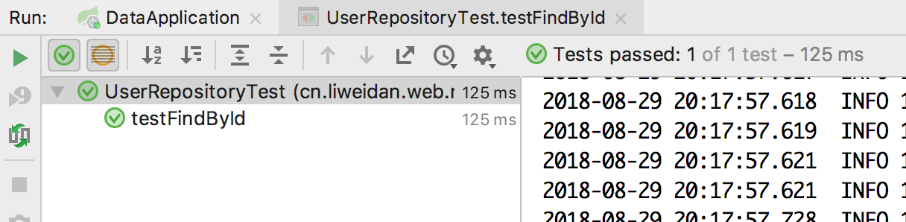

# `spring-boot` 使用 `jpa` 进行数据库访问

因为已经编写了 `web` 项目，此项目直接在 `web` 项目上新增数据库访问。此处使用的访问 `orm` 层是 `spring` 官方提供的 `spring-data-jpa`。

`spring-data-jpa` 是官方通过使用 `java` 规范中的 `jpa` 标准，使用 `hibernate` 框架作为 `orm` 层进行的数据库层面的请求访问。众所周知， `hibernate` 框架是针对数据库层面的面向对象框架，编写一次兼容所有数据库，不过前提是都使用他提供的 `hql` 或者接口进行编写。 `spring` 还对其新增了对领域驱动设计的友好支持。

## 一. 在项目中引入依赖

1. 引入 `spring-boot-starter-data-jpa` 框架，便已经让项目支持了数据库连接
2. 数据库驱动
3. 如若需要测试环境，再引入内存数据库以及测试驱动

```xml
<dependency>
    <groupId>org.springframework.boot</groupId>
    <artifactId>spring-boot-starter-data-jpa</artifactId>
</dependency>

<dependency>
    <groupId>mysql</groupId>
    <artifactId>mysql-connector-java</artifactId>
</dependency>

<!-- 测试支持，可以使用内存数据库 -->
<dependency>
    <groupId>com.h2database</groupId>
    <artifactId>h2</artifactId>
    <scope>test</scope>
</dependency>
<dependency>
    <groupId>org.springframework.boot</groupId>
    <artifactId>spring-boot-starter-test</artifactId>
    <scope>test</scope>
</dependency>
```

## 二. `yml` 文件新增数据库配置

```yaml
spring:
  datasource:
    driver-class-name: com.mysql.jdbc.Driver
    username: root
    password: root
    url: jdbc:mysql://localhost:3306/spring-data
  jpa:
    generate-ddl: true # 自动生成数据库表
    hibernate:
      ddl-auto: update # 启动时进行验证，可以设置成create-drop用于开发使用
```

## 三. 编写 `dbo` 类

需要使用 `jpa` 规范注解：

```java
@Entity
@Table(name = "user_info")
public class UserDo {

    @Id
    @GeneratedValue(strategy= GenerationType.IDENTITY)
    @Column(name = "user_id")
    private Long id;

    @Column(name = "user_name", length = 50)
    private String name;

    @Column(name = "user_age", length = 50)
    private Integer age;
    
    public UserDo() {
    }
    
    public UserDo(String name, Integer age) {
        this.name = name;
        this.age = age;
    }

    public Long getId() {
        return id;
    }

    public void setId(Long id) {
        this.id = id;
    }

    public String getName() {
        return name;
    }

    public void setName(String name) {
        this.name = name;
    }

    public Integer getAge() {
        return age;
    }

    public void setAge(Integer age) {
        this.age = age;
    }
}

```

## 四. 编写对应的 `repository` 类进行数据库访问

继承自 `JpaRepository`，第一个参数是 `dbo` 类，第二个参数是 `@Id` 的类型

```java
@Repository
public interface UserRepository extends JpaRepository<UserDo, Long> {
}
```

继承以后将自动拥有以下方法：

```java
List<T> findAll();

List<T> findAll(Sort var1);

List<T> findAll(Iterable<ID> var1);

<S extends T> List<S> save(Iterable<S> var1);

void flush();

<S extends T> S saveAndFlush(S var1);

void deleteInBatch(Iterable<T> var1);

void deleteAllInBatch();

T getOne(ID var1);

<S extends T> List<S> findAll(Example<S> var1);

<S extends T> List<S> findAll(Example<S> var1, Sort var2);
```

## 五. 启动类新增初始化代码

```java
@Bean
public CommandLineRunner demo(UserRepository userRepository) {
    return (args) -> {
        // 启动时进行初始化
        if (userRepository.findAll().size() < 1) {
            userRepository.save(new UserDo("Jane", 18));
            userRepository.save(new UserDo("Tony", 22));
            userRepository.save(new UserDo("Jenny", 31));
            userRepository.save(new UserDo("Gogo", 54));
        }
    };
}
```

## 六. 编写一个基本的 `rest` 资源控制器

```java
@RestController
@RequestMapping("user")
public class UserEndpoint {

    private UserRepository userRepository;

    @Autowired
    public UserEndpoint(UserRepository userRepository) {
        this.userRepository = userRepository;
    }

    @GetMapping
    @ResponseStatus(HttpStatus.OK)
    public List<UserDo> all() {
        return userRepository.findAll();
    }

    @GetMapping("{id}")
    @ResponseStatus(HttpStatus.OK)
    public UserDo idOf(@PathVariable("id") Long id) {
        return userRepository.findOne(id);
    }

    @PostMapping
    @ResponseStatus(HttpStatus.CREATED)
    public UserDo save(@RequestBody UserDo userDo) {
        return userRepository.saveAndFlush(userDo);
    }

    @PutMapping
    @ResponseStatus(HttpStatus.OK)
    public UserDo update(@RequestBody UserDo userDo) {
        return userRepository.saveAndFlush(userDo);
    }

    @DeleteMapping("{id}")
    @ResponseStatus(HttpStatus.ACCEPTED)
    public void delete(@PathVariable("id") Long id) {
        userRepository.delete(id);
    }

}

```

请求对应的接口，基本算是完成一个资源服务。

## 七. 测试用例

测试用例用的是 `spring-boot-test`，用于初始化 `spring` 容器以及对接口进行测试等。我只做一个 `getById`
使用 `h2` 内存数据库作为测试库。

### 7.1 新增测试环境配置

```yaml
spring:
  datasource:
    driver-class-name: org.h2.Driver
    username: h2
    password:
  jpa:
    generate-ddl: true
    hibernate:
      ddl-auto: update
```

### 7.2 编写测试类

```java
@RunWith(SpringRunner.class)
@SpringBootTest
@ActiveProfiles("test")
public class UserRepositoryTest {

    @Autowired
    UserRepository userRepository;

    private Long id;

    @Before
    public void setup() {
        UserDo userDo = new UserDo("Jane", 10);
        id = userRepository.save(userDo).getId();
    }

    @Test
    public void testFindById() {
        UserDo aUser = userRepository.findOne(id);
        assertEquals("Jane", aUser.getName());
    }

}
```

当然如果不想使用内存数据库，也可以使用MySQL，在测试类上方加上 `@Transactional` 注解即可实现测试完成数据回滚。




## 八. 修改数据源为 `druid`

[官方starter](https://github.com/alibaba/druid/tree/master/druid-spring-boot-starter)


