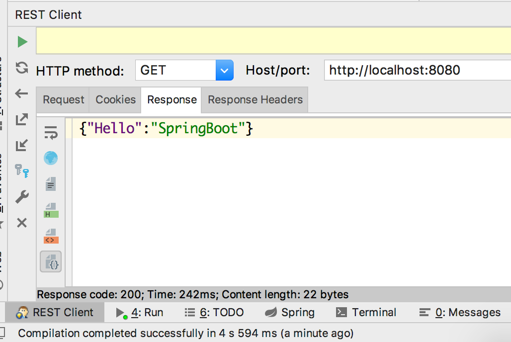

# `spring-boot` 的 `web` 开发项目

## 一. 导入 `spring-boot` 父类依赖

通常来说，使用 [官方脚手架](https://start.spring.io/) 生成的 `spring-boot` 的父类依赖都是 `spring` 官方提供的 `parent` 
然而，在实际生产中，这种方法，很少使用。我们更多的时候依赖自己项目中的父类进行生成。所以我们需要在自己的 `pom.xml` 中导入 `spring` 官方提供的 `parent` 

即使现在 `2.0.0` 版本已经出来了，新增了 `reactor` 功能，但是如果不使用这套功能的话，我依然推荐 `1.5.10.RELEASE` 版。

```xml
<dependencyManagement>
    <dependencies>
        <dependency>
            <!-- Import dependency management from Spring Boot -->
            <groupId>org.springframework.boot</groupId>
            <artifactId>spring-boot-dependencies</artifactId>
            <version>1.5.10.RELEASE</version>
            <type>pom</type>
            <scope>import</scope>
        </dependency>
    </dependencies>
</dependencyManagement>
```

## 二. 引入 `spring-boot-web` 依赖

在我们的子项目中引入 `web-starter` 模块即可进行 `rest-service` 开发：

```xml
<dependencies>
    <dependency>
        <groupId>org.springframework.boot</groupId>
        <artifactId>spring-boot-starter-web</artifactId>
    </dependency>
</dependencies>
```

## 三. 编写启动器

一般来说，项目都是作为微服务来做的，所以包名应该是 `公司域名.业务名` ，我在这里就简单的命名为 `cn.liweidan.web`

在该包下，除了有一个启动器的主类，其他类应该放置于包内。这里有个重点：**启动器只扫描他所在的包以及下级里的类（配置类或业务类）**。如果启动器
在外部，会出现以来报错问题。

启动类命名：我喜欢采用该项目的 业务+`Application` 的方式进行命名，比如该项目则为 `WebApplication`.

```java
package cn.liweidan.web;

import org.springframework.boot.SpringApplication;
import org.springframework.boot.autoconfigure.SpringBootApplication;

/**
 * Web项目启动器
 * @author liweidan
 * @date 2018/8/22 上午9:59
 * @email toweidan@126.com
 */
@SpringBootApplication // #1
public class WebApplication {

    public static void main(String[] args) {
        SpringApplication.run(WebApplication.class, args); // #2
    }

}

```

注意代码中的两个点：
1. 注解注释该类是个 `spring-boot` 项目的启动类
2. 通过调用 `SpringApplication` 的静态方法，传递该类的 `class` 实例进行启动。

可以直接通过 `ide` 启动该类，日志输出以下即表示启动成功：

```
2018-08-22 10:14:51.515  INFO 1789 --- [           main] s.b.c.e.t.TomcatEmbeddedServletContainer : Tomcat started on port(s): 8080 (http)
2018-08-22 10:14:51.520  INFO 1789 --- [           main] cn.liweidan.web.WebApplication           : Started WebApplication in 2.492 seconds (JVM running for 3.673)
```

## 四. 编写控制器

如果只是单纯提供 `JSON` 数据，那么就是一个 `Endpoint`

```java
package cn.liweidan.web.endpoint;

import org.springframework.web.bind.annotation.GetMapping;
import org.springframework.web.bind.annotation.RequestMapping;
import org.springframework.web.bind.annotation.RestController;

import java.util.HashMap;
import java.util.Map;

/**
 * 第一个控制器
 *
 * @author liweidan
 * @date 2018/8/22 下午2:42
 * @email toweidan@126.com
 */
@RestController // #1 使用 RestController 注解暴露返回类型是 application/json
@RequestMapping("hello-springboot") // #2 资源路径
public class HelloSpringBootEndpoint {

    @GetMapping // #3 rest 风格中的 get 操作
    public Map<String, Object> helloSpringBoot() {
        Map<String, Object> resp = new HashMap<>();
        resp.put("Hello", "SpringBoot");
        return resp;
    }

}

```

请求测试：


## 五. 添加拦截器

### 1. 开发拦截器

实现 `HandlerInterceptor` 接口，重写三个方法：

```java
/**
 * 登陆拦截
 *
 * @author liweidan
 * @date 2018/8/22 下午2:57
 * @email toweidan@126.com
 */
public class LoginInterceptor implements HandlerInterceptor {
    @Override
    public boolean preHandle(HttpServletRequest httpServletRequest, HttpServletResponse httpServletResponse, Object o) throws Exception {
        System.out.println("-----> 进入控制器之前");
        return true;
    }

    @Override
    public void postHandle(HttpServletRequest httpServletRequest, HttpServletResponse httpServletResponse, Object o, ModelAndView modelAndView) throws Exception {
        System.out.println("-----> 返回数据，渲染视图之前");
    }

    @Override
    public void afterCompletion(HttpServletRequest httpServletRequest, HttpServletResponse httpServletResponse, Object o, Exception e) throws Exception {
        System.out.println("-----> 渲染视图之后");
    }
}
```

### 2. 注册拦截器

在启动器之下的任意包中（我习惯放在 `config` 包中），添加配置类，注册拦截器，并添加拦截路径和排除的路径

```java
/**
 * 注册拦截器
 *
 * @author liweidan
 * @date 2018/8/22 下午3:02
 * @email toweidan@126.com
 */
@Configuration
public class HanderInterceptorConfig extends WebMvcConfigurerAdapter {

    @Override
    public void addInterceptors(InterceptorRegistry registry) {
        //注册自定义拦截器，添加拦截路径和排除拦截路径
        registry.addInterceptor(new LoginInterceptor())
                .addPathPatterns("/**")
                .excludePathPatterns("/hello-springboot");
    }

}
```

代码中我增加一个 `resource` 的资源控制器，可以参照对比拦截器行为。

## 六. 新增全局控制器通知

全局控制器通知实则是为了在请求出现业务异常（比如：未找到、参数错误、不能为空等等异常）的时候，返回所规定的格式以及状态码（如：rest 风格中，id 不存在的情况下返回404）

通常项目中总是会有类似的返回值统一的类：

```java
public class ResultDto<T> {

    private String code;
    private T data;
    private boolean isSuccess;
    private String errMsg;

    public ResultDto(String code, T data, boolean isSuccess, String errMsg) {
        this.code = code;
        this.data = data;
        this.isSuccess = isSuccess;
        this.errMsg = errMsg;
    }

    public String getCode() {
        return code;
    }

    public T getData() {
        return data;
    }

    public boolean isSuccess() {
        return isSuccess;
    }

    public String getErrMsg() {
        return errMsg;
    }
}
```

也会出现类似于参数错误，未找到的自定义异常：

```java
public class ItemNotFoundException extends RuntimeException {

    private String id;

    public ItemNotFoundException(String id) {
        super("未找到id为" + id + "的资源");
    }

    public String getId() {
        return id;
    }
}

```

有了控制器通知类，我们便可以在控制器层捕捉到这类业务性异常，返回我们所规定的数据以及格式

```java
@ControllerAdvice
@RestController
public class ExceptionControllerHandler {

    /**
     * 处理业务出现的异常
     * @param e
     * @return
     */
    @ExceptionHandler(ItemNotFoundException.class)
    @ResponseStatus(HttpStatus.NOT_FOUND)
    public ResultDto<Void> itemNotFoundException(ItemNotFoundException e) {
        return new ResultDto<>("404", null, false, e.getMessage());
    }

    /**
     * 处理业务出现的异常
     * @param e
     * @return
     */
    @ExceptionHandler(Exception.class)
    @ResponseStatus(HttpStatus.INTERNAL_SERVER_ERROR)
    public ResultDto<Void> serverException(Exception e) {
        return new ResultDto<>("500", null, false, e.getMessage());
    }

}
```

此时我请求 `resource`，假定 id 为 100 的资源不存在，抛出元素不存在异常，便可以接收到以下格式的返回值：

```json
{"code":"404","data":null,"errMsg":"未找到id为100的资源","success":false}
```

## 七. 多配置

开发了这么久，还没配置过一个配置文件，这是因为 `spring-boot` 提供了一系列的默认配置，在不需要修改的情况下，便不需要去配置这些参数。

那么在 `resources` 文件夹中，我们可以设置共同配置，以及不同环境的配置：
1. 共同配置可以配置诸如应用名称等通用的配置
2. 不同的环境配置可以配置中间件的连接参数

`application.yml` 配置了项目名称以及默认激活的环境为开发环境
```
spring:
  application:
    name: basic-web
  profiles:
    active: dev
```

`application-dev.yml` 只配置了端口信息
```
server:
  port: 8080
``` 

当把该项目打包成 `jar` 包的时候，运行时配置 `java -jar xxx.jar -Dspring.profiles.active=prod`即可切换成生产环境的配置

### 常用配置

我从官方附录上拷贝一些比较常用的配置：

```
# 日志配置相关
logging.config= # 日志配置文件的路径. For instance, `classpath:logback.xml` for Logback.
logging.file= # Log file name (for instance, `myapp.log`). Names can be an exact location or relative to the current directory.
logging.file.max-history=0 # 日志保留最大的数量，只支持logback
logging.file.max-size=10MB # 日志最大容量
logging.level.*= # 指定文件的日志等级. For instance, `logging.level.org.springframework=DEBUG`.
logging.path= # 日志存放的文件夹路径. For instance, `/var/log`.
logging.pattern.console= # Appender pattern for output to the console. Supported only with the default Logback setup.
logging.pattern.dateformat=yyyy-MM-dd HH:mm:ss.SSS # Appender pattern for log date format. Supported only with the default Logback setup.
logging.pattern.file= # Appender pattern for output to a file. Supported only with the default Logback setup.
logging.pattern.level=%5p # Appender pattern for log level. Supported only with the default Logback setup.
logging.register-shutdown-hook=false # Register a shutdown hook for the logging system when it is initialized.

# Email (MailProperties)
spring.mail.default-encoding=UTF-8 # Default MimeMessage encoding.
spring.mail.host= # SMTP server host. For instance, `smtp.example.com`.
spring.mail.password= # Login password of the SMTP server.
spring.mail.port= # SMTP server port.
spring.mail.properties.*= # Additional JavaMail Session properties.
spring.mail.protocol=smtp # Protocol used by the SMTP server.
spring.mail.test-connection=false # Whether to test that the mail server is available on startup.
spring.mail.username= # Login user of the SMTP server.

# 线程池配置  (TaskExecutionProperties)
spring.task.execution.pool.allow-core-thread-timeout=true # Whether core threads are allowed to time out. This enables dynamic growing and shrinking of the pool.
spring.task.execution.pool.core-size=8 # Core number of threads.
spring.task.execution.pool.keep-alive=60s # Time limit for which threads may remain idle before being terminated.
spring.task.execution.pool.max-size= # Maximum allowed number of threads. If tasks are filling up the queue, the pool can expand up to that size to accommodate the load. Ignored if the queue is unbounded.
spring.task.execution.pool.queue-capacity= # Queue capacity. An unbounded capacity does not increase the pool and therefore ignores the "max-size" property.
spring.task.execution.thread-name-prefix=task- # Prefix to use for the names of newly created threads.

# WEB CONFIG
server.port=8080 # 端口

# DATASOURCE (DataSourceAutoConfiguration & DataSourceProperties)
spring.datasource.continue-on-error=false # 初始化数据库连接池的时候，出现异常是否继续初始化
spring.datasource.data= # Data (DML) script resource references. 数据库数据初识文件
spring.datasource.driver-class-name= # 驱动名称
spring.datasource.generate-unique-name=false # 是否随机生成一个数据库名称
spring.datasource.hikari.*= # Hikari specific settings
spring.datasource.initialization-mode=embedded # Initialize the datasource with available DDL and DML scripts.
spring.datasource.name= # Name of the datasource. Default to "testdb" when using an embedded database.
spring.datasource.password= # 登陆数据库密码
spring.datasource.schema= # 表结构文件
spring.datasource.type= # 修改连接池驱动
spring.datasource.username= # 登陆数据库用户名

# JPA (JpaBaseConfiguration, HibernateJpaAutoConfiguration)
spring.jpa.generate-ddl=false # 初始化的时候是否创建数据表
spring.jpa.hibernate.ddl-auto= # DDL 模式，跟hibernate的一致. This is actually a shortcut for the "hibernate.hbm2ddl.auto" property. Defaults to "create-drop" when using an embedded database and no schema manager was detected. Otherwise, defaults to "none".
spring.jpa.show-sql=false # 是否在日志打印sql语句
```


